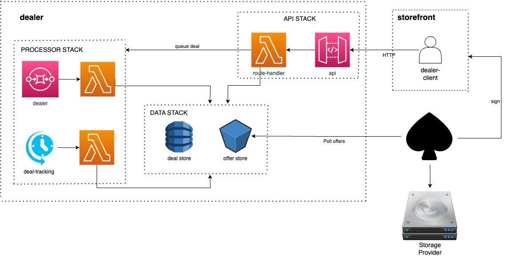

# Architecture

> The dealer architecture.

## Background

[web3.storage](http://web3.storage) is a Storefront providing APIs to enable users to easily upload CAR files, while getting them available on the IPFS Network and stored in multiple locations via Filecoin Storage Providers.

A dealer facilitates storing data with Filecoin Storage Providers. It receives requests from a Storefront to get their data stored. Dealers MAY have requirements like minimum/maximum size of a Filecoin Piece. Given that Storefront actors handles files of any size, a Storefront can also rely on Aggregators to pack sets of CAR files together in order to get big Filecoin Pieces that can be queued for Storing to the Dealer. You can read more on the [w3filecoin spec](https://github.com/web3-storage/specs/blob/main/w3-filecoin.md).

The dealer relies on Spade as a broker to get their user data into Filecoin Storage Providers. Currently, Spade requires a Filecoin Piece with size between 16GiB and 32GiB to create deals with Filecoin Storage Providers. Moreover, the closer a Filecoin Piece is closer to the upper bound, the most optimal are the associated storage costs.

## High Level design

The dealer is modeled into 3 different SST Stacks that will have their infrastructure provisioned in AWS via AWS CloudFormation. These are:

- API Stack
- Processor Stack
- Data Stack



## API Stack

The dealer stack has an API that authorized _Storefront_s can use in order to:

- submit deal _offers_s to get Filecoin deals with Storage Providers.
  - `offer` is added to the `offer-store` and added to the queue processor pipeline. See [offer schema](#offer-store-schema).
  - once processed, it is added to the `deal-store` to enable tracking of whether given offer makes its way to Storage Providers. As a result, a receipt will be processed.

## Processor Stack

When deal _offers_s are submitted into the dealer, the dealer queues the offer to be handled in the `dealer-queue`. Once the queue consumer is called, it stores the deal added into the `deal-store` to be tracked.

TODO: CRON Job for tracking deals and self invoke `/add` to generate receipt

## Data Stack

The Data stack is responsible for the state of the dealer. It stores the received deal offers and keepts track of the submitted deal requests state over time.

| store         | type     | key                     |
|---------------|----------|-------------------------|
| offer-store   | S3       | `${nowDate} {aggregate}`|
| deal-store    | DynamoDB | `aggregate`             |

### `offer-store` schema

```typescript
interface Offer {
  // CID of the piece `bagy...content`
  aggregate: PieceCID
  // CID of all the segments part of the aggregate
  pieces: PieceCID[]
  // identifier of the tenant for the storefront `did:web:web3.storage`
  // spade relies on tenant naming, so we map it here to tenant
  tenant: string
  // enables ordering of offers to handle.
  // Being it the number of ms since epoch, also means offers that fail and are retried will have "priority"
  // It can also have lower numbers to prioritize certain actors in the future
  orderID: string
}
```

### `deal-store` schema

```typescript
interface Deal {
  // CID of the piece `bagy...content` (primary index, partition key)
  aggregate: PieceCID
  // identifier of the storefront `did:web:web3.storage`
  storefront: string
  // encoded URI with location of the offer, e.g. 's3://${bucket}/${key}'
  offer: string
  // known status of the deal (a secondary index)
  // Note: DynamoDB does not allow usage of status keyword
  stat: DealStatus
}

type DealStatus =
  | OFFERED
  | APPROVED
  | REJECTED

type OFFERED = 0
type APPROVED = 1
type REJECTED = 2
```

## Spade integration

Spade will read new offers available from the `offer-store` once it has availability to process more deals. Thanks to the `orderId` property, it will be able to sort submitted deals by desired priority.